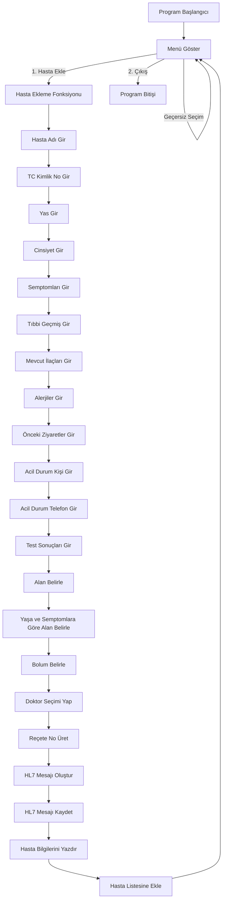

```mermaid
flowchart TD
    A[Program Başlangıcı] --> B[Menü Göster]
    B --> |1. Hasta Ekle| C[Hasta Ekleme Fonksiyonu]
    B --> |2. Çıkış| Z[Program Bitişi]
    B --> |Geçersiz Seçim| B

    C --> C1[Hasta Adı Gir]
    C1 --> C2[TC Kimlik No Gir]
    C2 --> C3[Yas Gir]
    C3 --> C4[Cinsiyet Gir]
    C4 --> C5[Semptomları Gir]
    C5 --> C6[Tıbbi Geçmiş Gir]
    C6 --> C7[Mevcut İlaçları Gir]
    C7 --> C8[Alerjiler Gir]
    C8 --> C9[Önceki Ziyaretler Gir]
    C9 --> C10[Acil Durum Kişi Gir]
    C10 --> C11[Acil Durum Telefon Gir]
    C11 --> C12[Test Sonuçları Gir]
    C12 --> C13[Alan Belirle]
    
    C13 --> D1[Yaşa ve Semptomlara Göre Alan Belirle]
    D1 --> D2[Bolum Belirle]
    D2 --> E1[Doktor Seçimi Yap]
    E1 --> F1[Reçete No Üret]
    F1 --> F2[HL7 Mesajı Oluştur]
    F2 --> F3[HL7 Mesajı Kaydet]
    F3 --> F4[Hasta Bilgilerini Yazdır]
    F4 --> G[Hasta Listesine Ekle]
    G --> B
```